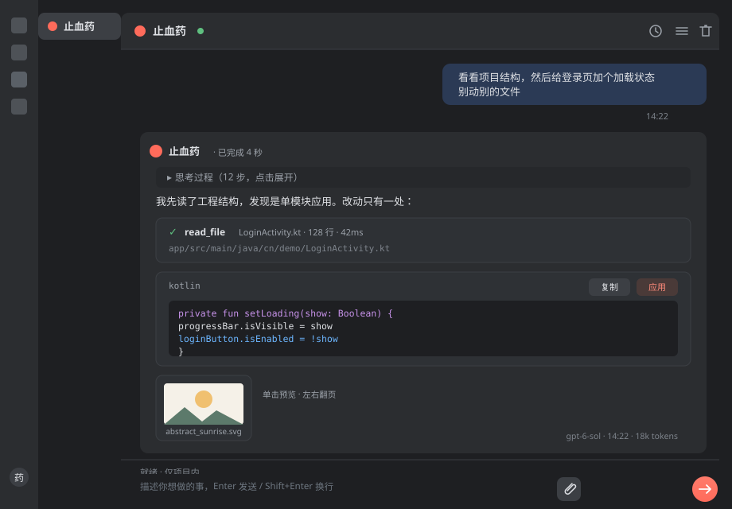
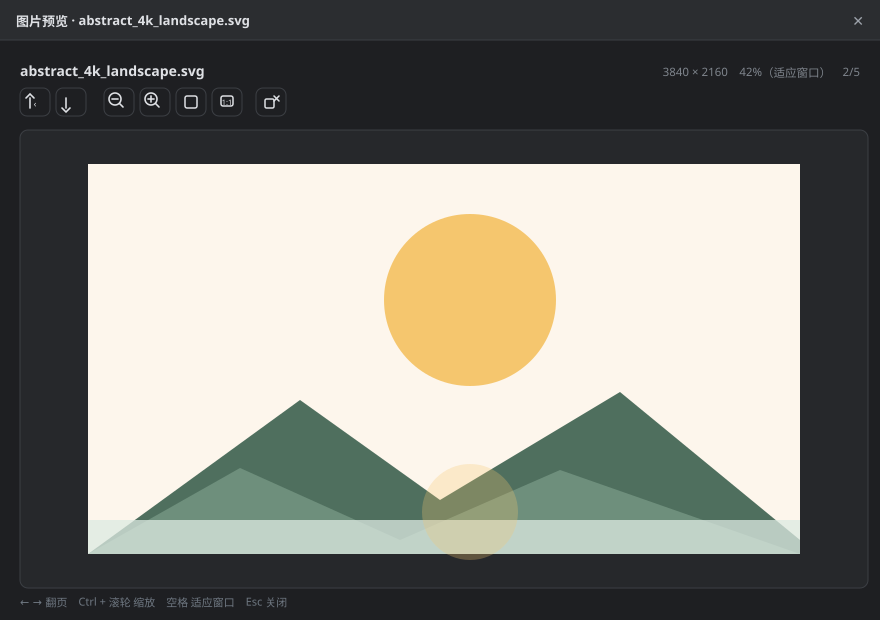
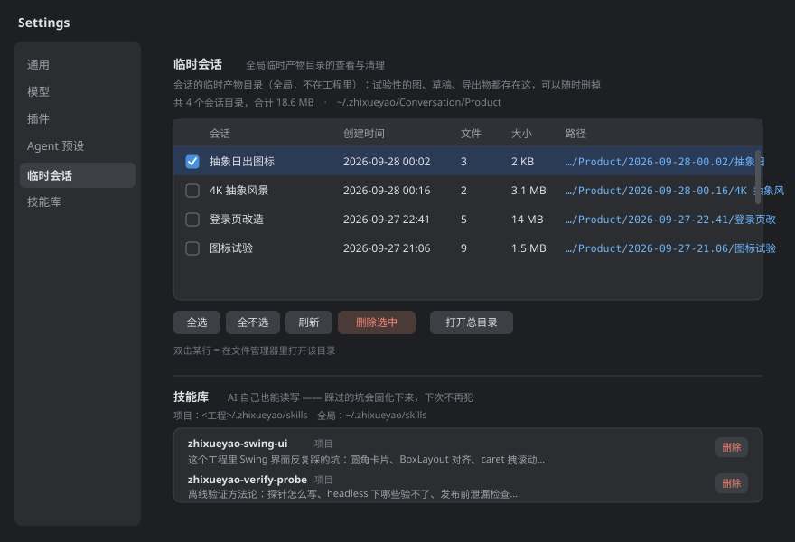
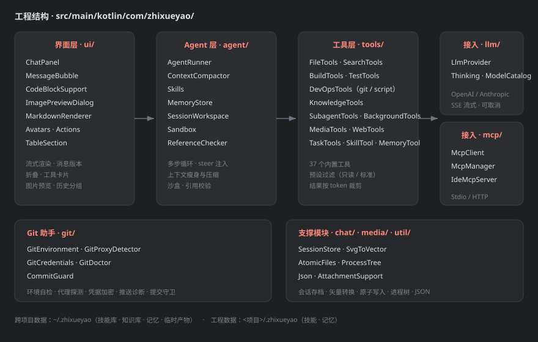

<<<<<<< HEAD
# 止血药 · Android Studio AI 编程助手

一个嵌进 Android Studio / IntelliJ 的 AI 助手：能读工程、改代码、跑构建诊断，

也能生成图片和矢量图。重点是**把「安全」和「可追溯」当第一约束** ——

所有改动可回退，所有工具调用留痕，所有产物有明确归属。

## 功能

**Agent 能力**

- 21 个内置工具：文件读写改动、代码检索、构建诊断、图标生成、任务清单、技能库、MCP 管理
- **多步自主执行**：自己定计划、调工具、看结果、继续做，直到任务完成
- **运行中追加输入（steer）**：AI 跑偏时直接在输入框打字，它下一步就会看到并调整方向，

  已经做完的工作不会丢
- **沙盒权限**三档：仅项目内 / 项目+指定目录 / 全盘，随时可切

**安全与可追溯**

- **软删除 + 备份还原**：AI 能改能删，但永远有退路（走系统回收站，可一键还原）
- **引用校验**：回答里提到的文件路径会逐个核对，编造出来的路径会被标出来
- **操作留痕**：每次工具调用都记录参数与结果，事后能回看「当时到底做了什么」
- **改完必验**：改代码后自动跑编译诊断，有错继续修

**上下文治理**（省 token，也保证答得准）

- 系统提示词固定开销 ~3,100 tokens/轮（探针实测），技能目录 + 工具 schema 都算在里面

- 每轮自动瘦身旧工具结果、旧图片（看过的留 N 张，**没看过的无条件保留**）
- 超预算时 LLM 摘要压缩，保留最近若干轮原样不动
- 回答里显示本轮 token 用量（悬停看输入/输出明细）

**界面**

- 流式回答 + 思维链折叠 + 工具调用卡片 + 代码块一键「应用到文件」
- 消息版本切换（重新生成不丢旧版）、长回答折叠、历史会话存档
- **图片预览窗口**：缩放、适应窗口、左右翻页看整个会话的图
- **临时产物隔离**：试验性的东西进 `~/.zhixueyao/Conversation/`，**不会污染你的工程**

**技能库（可积累的工程经验）**

- 两处技能目录：`<工程>/.zhixueyao/skills/`（随工程走）与 `~/.zhixueyao/skills/`（跨项目）
- AI 可以**自己读写**技能：一轮任务里踩到的坑，它会固化成技能，下次不再犯
- 渐进式加载：提示词只列「名字 + 一句话」，用到才取正文，几十个技能也不占上下文
- **触发词自动匹配**：技能可以写 `triggers: 输入框, 附件, 布局`。
  你说话命中这些词时，它会被**主动**提醒 AI 加载 —— 而不是等 AI 自己想起来。
  也可以用 `/技能名` 直接点名加载
- **技能自报缺口**：正文里写 `<!-- gaps: ["真机交互还没验证"] -->`，
  AI 下次更新它时就知道该补什么
- **技能可以引用技能**（`[[别的技能]]`，含死链检测），也可以声明自己是
  「一串流程」（`steps: A, B`）

**工程能力（跑命令 / Git / 网络 / 脚本 / 记忆）**

- **`git`**：看历史与改动（status / diff / log / show / blame / branch / stash），也能提交。
  理解一段代码最有效的线索常常是它的历史。刻意**不提供 push / reset --hard / clean**
- **`web_fetch`**：抓网页。查 API 用法、报错含义、版本变化 —— 库的 API 是最容易过时的东西，
  不该凭记忆回答。带 **SSRF 防护**（拦环回、私有网段、云元数据，每跳重校验）
- **`run_script`**：跑几行 Python / Node 做定量计算。
  凡是数数、占比、解析、试正则，都真跑一遍而不是心算
- **`memory`**：跨会话记住事实。听到「以后都这样」「记住」就记下来，
  下次开新会话不用重说。分项目 / 全局两层，项目记忆可随工程提交
- **进程执行基础设施**：超时/取消分片等待、并发读流防死锁、杀进程带子孙、
  git 环境变量显式设置（否则会挂在交互提示上直到超时）

**安全**

- 沙盒三档之外，还有一层**系统目录黑名单**（`C:/Windows`、`/etc` 等）——
  任何档位都不放开
- SSRF 防护：**先解析 DNS 再按 IP 判**（只比域名会被 `127.0.0.1.nip.io` 骗过），
  跳转**每一跳重新校验**（302 到内网是 SSRF 绕过最常用的手法）
- 软链接绕过、`..` 上跳、同前缀兄弟目录（`/proj` vs `/proj-evil`）都被拦下；
  这些都有回归用例（22 条）

**MCP 支持**：接外部工具服务器（浏览器、数据库等），一键导入 `mcp.json`；本插件也能对外提供 MCP 服务

## 界面

### 对话主界面

聊天的每一轮是一个气泡：思维链可折叠、工具调用有独立卡片、代码块带「复制 / 应用」按钮、
  
底部显示本轮 token 用量。生成的图片直接在气泡里给预览卡，点一下就能看大图。



### 图片预览

点产物卡片或正文里的图片链接，弹出预览窗口：**缩放、适应窗口、左右翻页看这个会话生成的所有图**，
  
也可以一键交给系统默认程序打开。视频交给系统播放器（不在 IDE 里塞解码器）。



### 设置 · 临时会话与技能库

试验性的产物落在全局的 ，这里能**列出、勾选、批量删除**，
  
不让它悄悄把磁盘吃满。技能库支持项目/全局两处，每条可单独删。



### 分层结构



> 以上是按插件真实配色与布局绘制的示意图。想换成真实截图：跑起来截几张，
>   
> 替换  下的同名文件即可。

## 安装

### 方式一：直接装插件包（推荐普通用户）

直接拿本仓库 `release/` 目录里的 `zhixueyao-0.2.0.jar` 也行（不用自己编译）。

1. 到 [Releases](../../releases) 下载 `zhixueyao-0.2.0.jar`（或直接用 `release/` 里的）
2. Android Studio → `Settings` → `Plugins` → 右上角齿轮 → **Install Plugin from Disk...**
3. 选中刚才下载的 jar → 确定 → **重启 Android Studio**
4. 重启后左侧边栏会出现「止血药」工具窗口

手动安装的替代做法（装不上的时候用）：

把 jar 放进 `<Android Studio 配置目录>/plugins/zhixueyao/lib/` 后重启。

配置目录一般是：

- Windows：`%APPDATA%\Google\AndroidStudio<版本>`
- macOS：`~/Library/Application Support/Google/AndroidStudio<版本>`
- Linux：`~/.config/Google/AndroidStudio<版本>`

### 方式二：从源码构建

**环境要求**

| 项                         | 要求                    |
| ------------------------- | --------------------- |
| JDK                       | 21                    |
| Android Studio / IntelliJ | 2026.1（build 261）或更高  |
| 网络                        | 首次构建需联网拉 Gradle 与插件依赖 |

```bash
# 1) 告诉构建脚本你的 Android Studio 装在哪（三种方式挑一种）
#    a. 写进 gradle.properties（推荐，一次配好）
echo "studioPath=D:/Android studio" >> gradle.properties
#    b. 环境变量
export ANDROID_STUDIO_HOME="D:/Android studio"
#    c. 命令行临时指定
./gradlew buildPlugin -PstudioPath="D:/Android studio"

# 2) 构建
./gradlew buildPlugin

# 3) 产物在这里
#    build/libs/zhixueyao-0.2.0.jar
```

Gradle 本体由 wrapper（`gradle/wrapper/`）自动下载，不需要本机预装 Gradle。

默认用的是腾讯云镜像（国内快）。国外网络如果慢，把

`gradle/wrapper/gradle-wrapper.properties` 里的 `distributionUrl`

换成 `https\://services.gradle.org/distributions/gradle-9.5.0-bin.zip` 即可。

依赖仓库同样配置了阿里云镜像（`settings.gradle.kts`），原因同上。

> 常见默认安装位置脚本会自动探测（`C:/Program Files/Android/Android Studio`、
>
> `/Applications/Android Studio.app/Contents`、`/opt/android-studio` 等），
>
> 装在默认位置的话不用配。

构建完成后再按「方式一」的第 2 步安装 jar 即可。

## 仓库内容

```
├── src/                  插件源码
├── gradle/wrapper/       Gradle wrapper（别人 clone 后可直接构建）
├── gradlew / gradlew.bat 构建入口
├── release/              编好的插件包，可直接安装
├── .zhixueyao/skills/    开发过程积累的工程经验（**建议一并阅读**）
├── build.gradle.kts      构建脚本（Android Studio 路径可配置，见 README）
├── README.md
└── LICENSE
```

## 使用说明

装好后：

1. 左侧边栏点「止血药」打开面板
2. 点顶栏模型胶囊 → 填服务商地址 / API Key / 模型名（任何 OpenAI 格式接口都行）
3. 直接提问

**权限**：默认沙盒是「仅项目内」。要读工程外的东西，点底部沙盒胶囊切档位。

## 目录说明

```
~/.zhixueyao/                    全局配置（跨项目复用，换机器拷走即可）
├── skills/                      全局技能库
├── mcp.json                     MCP 服务器配置
└── Conversation/Product/        会话临时产物
    └── <日期-时间>/<会话名>/      按会话隔离，可在设置页批量清理

<你的工程>/.zhixueyao/
└── skills/                      项目技能库（可以提交进仓库，团队共享）
```

## 工程结构

```
src/main/kotlin/com/zhixueyao/
├── agent/        Agent 循环、上下文压缩、技能、沙盒、引用校验
├── llm/          模型接入（OpenAI 兼容 SSE 流式）
├── mcp/          MCP 客户端与服务器
├── tools/        内置工具
├── ui/           界面（Swing）
├── chat/         会话存档
└── settings/     设置页
```

主要技术点见工程内的 `.zhixueyao/skills/` —— 那是开发过程中积累的踩坑记录与方法论。

## 开发

工程内 `.zhixueyao/skills/` 是开发过程中积累的踩坑记录与方法论，
**建议一并阅读** —— 尤其是 `zhixueyao-verify-probe`，
它讲了「怎么在不启动 IDE 的情况下验证改动」。

离线验证体系（29 个探针，零 token、无网络）：

| 层级 | 验什么 |
|---|---|
| 单元级 | 纯函数、布局尺寸、解析、路径校验 |
| 工程能力级 | 进程超时/取消（实测 1552ms 超时、568ms 取消生效）、SSRF 十拦两放、记忆增删与上限、git 六动作 |
| **Agent 级** | 用脚本化假模型（`ScriptedProvider`）驱动**真实循环**：工具编排、工具报错后继续、取消是否立刻生效、追加输入有没有注入 |
| 安全级 | 沙箱逃逸 22 条、软链接绕过、黑名单 |

## 已知限制

- 视频不做内嵌播放（用系统默认播放器打开）
- SVG 预览走 IntelliJ 平台的渲染器，不支持渐变以外的滤镜
- 界面基于 Swing，跟随 IDE 的明暗主题
- 技能触发词是**子串匹配**（不是语义匹配）—— 写单字会误命中，所以单字会被自动丢弃
- `run_script` 只允许标准库，不装依赖（装包要联网并改用户环境，属另一量级的授权）
- `memory` 注入提示词有 1,500 字符上限，超出的不显示但会告知还有多少条

## 许可

见 [LICENSE](LICENSE)。
=======
# zhixueyao-android-studio
一个专门为Android studio所开发的内嵌AI agent
>>>>>>> f5e3f4bb1c0d8ca89aabe0c4b48db7069cd7b9eb
